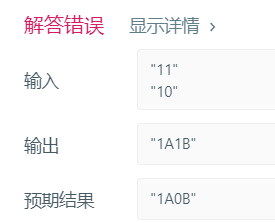

# 题目描述  (同类型题目： 189，299)

你正在和你的朋友玩 [猜数字（Bulls and Cows）](https://baike.baidu.com/item/%E7%8C%9C%E6%95%B0%E5%AD%97/83200?fromtitle=Bulls+and+Cows&fromid=12003488&fr=aladdin)游戏：你写下一个数字让你的朋友猜。每次他猜测后，你给他一个提示，告诉他有多少位数字和确切位置都猜对了（称为“Bulls”, 公牛），有多少位数字猜对了但是位置不对（称为“Cows”, 奶牛）。你的朋友将会根据提示继续猜，直到猜出秘密数字。

请写出一个根据秘密数字和朋友的猜测数返回提示的函数，用 `A` 表示公牛，用 `B` 表示奶牛。

请注意秘密数字和朋友的猜测数都可能含有重复数字。

## 示例1：  

```
输入: secret = "1807", guess = "7810"

输出: "1A3B"

解释: 1 公牛和 3 奶牛。公牛是 8，奶牛是 0, 1 和 7
```

## 示例2:

```javascript
输入: secret = "1123", guess = "0111"

输出: "1A1B"

解释: 朋友猜测数中的第一个 1 是公牛，第二个或第三个 1 可被视为奶牛。
```

### 说明：

+ 你可以假设秘密数字和朋友的猜测数都只包含数字，并且它们的长度永远相等。

<br/>  

## 自己解题：  (未通过所有测试用例)

```javascript
/**
 * @param {string} secret
 * @param {string} guess
 * @return {string}
 */
var getHint = function(secret, guess) {

    var j=0,k=0;
    
    
    for(var m=0; m<secret.length; m++){
        for(var n=0; n<secret.length; n++){
            
            if(m==n&&secret[m]==guess[n]){
                j++;
                break
            }
            
            //  问题出在这一步，这是因为当(m!=n&&secret[m]==guess[n])情况，存在时，并没有排除
            //  (m==n&&secret[m]==guess[n])时的情况；换句话说，当secret中有一项满足bulls时，
            //  这一项仍旧会继续与后面项进行比较，满足cows。
            else if(m!=n&&secret[m]==guess[n]){  
                k++;
                break;
            }
        }
    }
    
    return j+"A"+k+"B"
};
```

#### 出现错误：



###  正确解法：

~~~ javascript
*/
/**
 * @param {string} secret
 * @param {string} guess
 * @return {string}
 */
var getHint = function(secret, guess) {
    var len = secret.length,
        bullCount = 0,
        arr = {},
        cowCount = 0,
        i;
    
    for (i = 0; i < len; i++) {
        if (!arr[secret.charAt(i)]) {
            arr[secret.charAt(i)] = 1;
        } else {
            arr[secret.charAt(i)]++;
        }
    }
    
    for (i = 0; i < len; i++) {
        if (secret.charAt(i) === guess.charAt(i)) {
            bullCount++;
            arr[secret.charAt(i)]--;
        }
    }
    
    for (i = 0; i < len; i++) {
        if (secret.charAt(i) !== guess.charAt(i) && arr.hasOwnProperty(guess.charAt(i)) && (arr[guess.charAt(i)] > 0)) {
            cowCount++;
            arr[guess.charAt(i)]--;
        }
    }
    
    return bullCount + 'A' + cowCount + 'B';
};
~~~

~~~ javascript
var getHint = function(secret, guess) {
    var s = secret.split('');
    var g = guess.split('');
    var b=0,c=0;
    var map={};
    for(var i=0;i<s.length;i++){
        if(map[s[i]]===undefined){
            map[s[i]]=1;
        }else map[s[i]]++
    }
    console.log(map)
    for(var i=0;i<g.length;i++){
        if(g[i] === s[i]){
          b++;
          map[g[i]]--
        }
    }
    for(var i=0;i<g.length;i++){
        if(map[g[i]]>0 && g[i] !== s[i]){
          c++;
          map[g[i]]--
        }
    }
    return b+'A'+c+'B'
};


var getHint = function(secret, guess) {
    var bulls = 0;
    var cows = 0;
    var numbers = new Array(10);
    for (var i = 0; i<secret.length; i++) {
        if (secret.charAt(i) === guess.charAt(i)) bulls++;
        else{
            if (numbers[secret.charAt(i)-'0'] === undefined)numbers[secret.charAt(i)-'0'] = 0;
            if (numbers[secret.charAt(i)-'0']++ < 0) cows++;
            if (numbers[guess.charAt(i)-'0'] === undefined)numbers[guess.charAt(i)-'0'] = 0;
            if (numbers[guess.charAt(i)-'0']-- > 0) cows++;
        }
    }
    return bulls + "A" + cows + "B"
};
~~~

